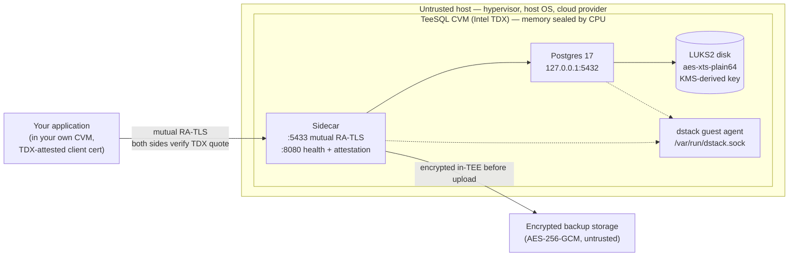

A Trusted Execution Environment (TEE) is the foundation TeeSQL is built on. This page explains what a TEE is, how Intel Trust Domain Extensions (TDX) implement one, and exactly which components run inside the protected boundary versus outside it.

## What is a TEE

A TEE is an isolated execution context whose memory and CPU state are protected from everything else on the machine — the host operating system, the hypervisor, the cloud provider's management plane, even other workloads on the same physical hardware. The protection is enforced by the CPU itself, not by software policy, so it holds even when the surrounding system is fully compromised.

A program running in a TEE can prove what it is to a remote party through **attestation**: the CPU produces a signed report (a "quote") that contains cryptographic measurements of the code, configuration, and platform state. A relying party verifies the quote against the chip vendor's signing chain, then decides whether to trust the program with secrets or queries.

The point of a TEE is to make a small, well-defined component the only thing the user has to trust — and to make "trust" mean "verify a hardware signature" rather than "rely on the operator's promise."

## Intel TDX

Intel TDX builds the TEE at the level of an entire virtual machine. A **Confidential Virtual Machine (CVM)** is a guest VM whose memory is encrypted by the CPU's memory controller using keys that exist only inside the silicon. The hypervisor schedules the CVM but cannot read its memory; the host OS sees encrypted ciphertext where the guest sees plaintext.

TDX maintains a set of **Runtime Measurement Registers (RTMRs)** that record what has been loaded into the CVM:

- The guest kernel image
- The boot parameters and initramfs
- The application stack at runtime

The CPU also records a **Measurement of Trust Domain (MRTD)** — a fingerprint of the initial CVM image. Together, MRTD and RTMR0–3 produce a TDX quote that proves: this CVM started from a specific image and is running a specific software stack right now.

A relying party can verify the quote against [Intel Trust Authority](https://portal.trustauthority.intel.com) (a hosted REST service) or perform local **DCAP** verification using Intel's signing chain. Either path proves that the quote came from a genuine Intel TDX CPU and that the platform's Trusted Computing Base (TCB) — firmware and microcode — is up to date.

## What runs inside the CVM

TeeSQL's CVM contains three user-visible processes — Postgres, the sidecar, and the dstack guest agent — running on a locked-down guest kernel:

| Component | Role |
|---|---|
| PostgreSQL 17 | The database itself, listening on `127.0.0.1:5432` only |
| TeeSQL sidecar | Mutual RA-TLS proxy on `:5433`, sidecar HTTP API on `:8080` (`/health`, `/attestation`), KMS-derived password injection, encrypted backup export |
| dstack guest agent | Unix socket at `/var/run/dstack.sock`. Provides TDX quotes, derives keys from KMS, issues RA-TLS certificates |
| Locked-down guest kernel | Minimal Linux image, no shell, no SSH, no root login |

Postgres data lives on a LUKS2-encrypted block device (`aes-xts-plain64`) whose key is derived from the dstack KMS at boot. The key only exists inside CVM memory — there is no persistent on-disk copy, no operator-accessible backup of the key, and no way to mount the volume outside an attested CVM with the matching identity.

What is **not** inside the CVM:

- The hypervisor, host OS, and cloud provider's management plane
- The dstack KMS itself (runs in its own attested TEE instance, separate from the database CVM)
- The dstack gateway (runs in its own attested CVM, separate from the database CVM)
- Backup storage (treated as adversarial; backups are encrypted inside the CVM with AES-256-GCM before upload)
- Your application, unless you also run it inside a CVM (recommended for mutual RA-TLS)

## Trust boundary

The host physically runs the CVM but cannot read its memory — the CPU enforces the seal. The CVM is reachable only after a successful mutual RA-TLS handshake on `:5433`. Backups are encrypted inside the CVM before they leave it, so the storage layer is also treated as untrusted.

## Threat model

<Info>
**TeeSQL protects against:**

- A compromised host OS or hypervisor reading CVM memory or the on-disk LUKS2 device
- A cloud provider operator extracting environment variables, cached pages, or backup blobs from the host
- A malicious TeeSQL operator: the database password is derived from the KMS inside the CVM and is not held by any human
- A man-in-the-middle on the network between your application and the cluster: mutual RA-TLS binds the TLS public key to the TDX quote via the `REPORTDATA` field
- A network attacker substituting a different CVM at the same address: the MRTD pin (`allowedMrTd`) detects image swaps
- Backup-storage compromise: blobs are AES-256-GCM-encrypted inside the TEE before upload
</Info>

<Warning>
**TeeSQL does not protect against:**

- A complete break of the Intel TDX silicon — no current TEE survives a full hardware compromise of the CPU
- A state-level adversary with physical access to the chip: side-channel and decapping attacks against TDX are an active research area; if your threat model includes nation-state hardware adversaries, no commercially available TEE is sufficient today
- A vulnerability in your own application: TeeSQL trusts an attested client; if your CVM is compromised at the application layer, that compromise extends to the database connection
- Loss of availability: TDX is a confidentiality-and-integrity primitive, not an availability one. The host can stop the CVM at any time
- Bugs in your SQL or schema: confidential storage does not make incorrect queries return correct results
</Warning>

## Related

- [Security overview](/security/overview)
- [SSL & TLS](/connect/ssl-tls)
- [Remote attestation](/security/remote-attestation)
- [Verify attestation](/security/verify-attestation)
